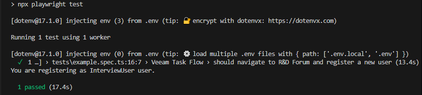

# SDET Task: End-to-End Test with Playwright

This project contains an automated UI end-to-end test written using the [Playwright](https://playwright.dev/) framework. The test verifies a specific scenario related to the Veeam website's forum registration process.

## 📋 Test Scenario

The test follows this scenario:

1. Visit [https://www.veeam.com/](https://www.veeam.com/)
2. Navigate to **Support → R&D Forums**
3. Follow the link to the forum page
4. Agree to Registration Terms
5. Attempt to register using credentials:
   - **Name**: `XXX`
   - **Password**: `XXX`
   - **Email**: `XXX@gmail.com`
6. Expect an error message indicating public email domains are not allowed:
`Public email are not allowed. Please, be aware that your domain or email address was banned.`

---

## ✅ Test Plan

| Step | Action | Expected Result |
|------|--------|------------------|
| 1 | Open [https://www.veeam.com/](https://www.veeam.com/) | Homepage loads successfully |
| 2 | Hover or click on **Support** menu | Dropdown appears |
| 3 | Click on **R&D Forums** link | Redirects to the forums page |
| 4 | Click **Register** | Registration page opens |
| 5 | Click on **I AGREE TO THESE TERMS** button | Terms are accepted |
| 6 | Fill in the registration form with specified data | Form accepts the input |
| 7 | Submit the form | Error message appears indicating public domains are not accepted |
| 8 | Validate the error message | Error message is displayed (contains `Public email are not allowed.`) |

---

## 🚀 Getting Started

### Prerequisites

- Node.js (>=22.x)
- npm 
- latest Plawyright

### Installation

# Clone the repo
`https://github.com/BeataKr/sdet_task.git`

# Install dependencies
`npm install`

# Rename .env.template file to .env and fill in the values
```
USER_LOGIN=
USER_PASSWORD=
USER_MAIL=
```

# Run the test 
`npm run test`

with headed mode `npm run test:headed`
with ui mode `npm run test:ui`

